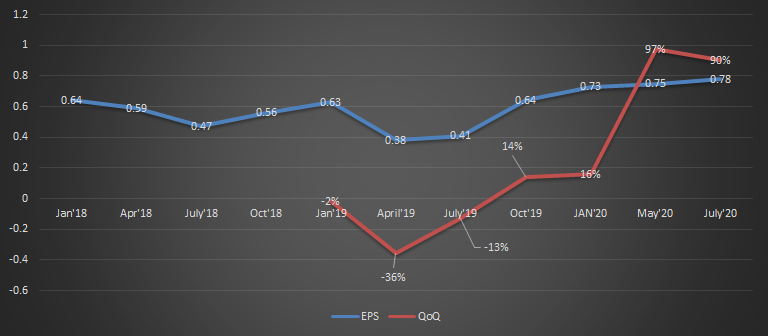
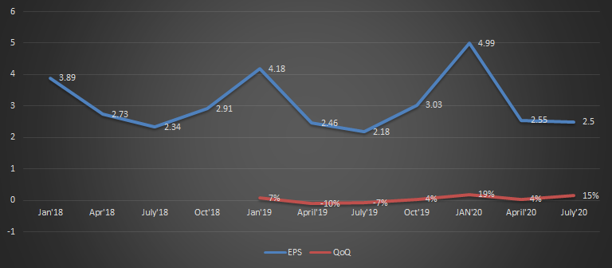
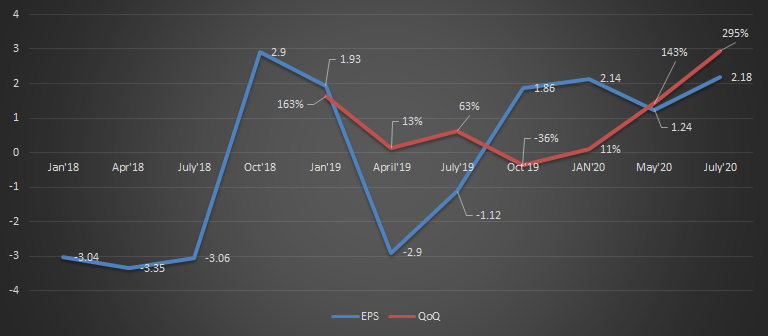
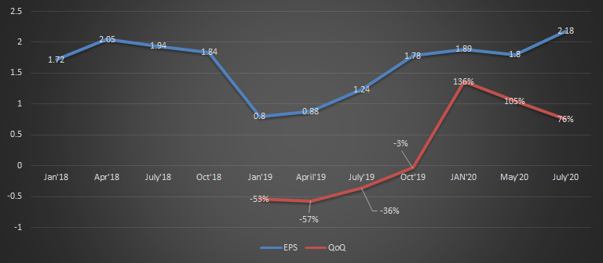
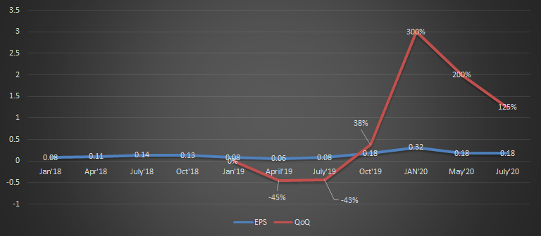
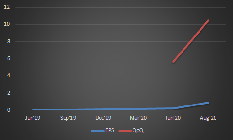
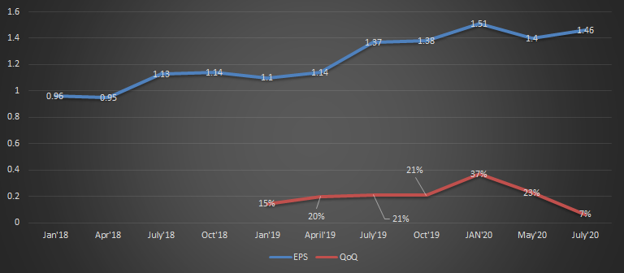
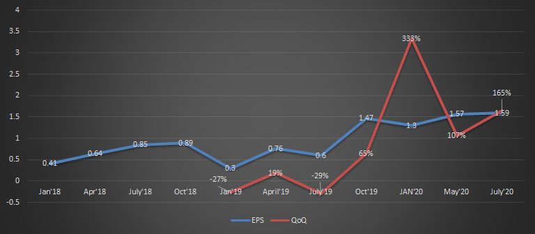
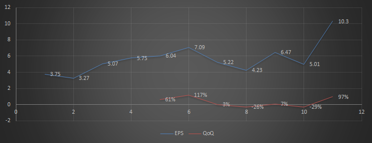

[20200927] Top 3: ???? 

### TSM 

* EPS report: 

	| Jan'18 | Apr'18 | July'18 | Oct'18 | Jan'19 | April'19 | July'19 | Oct'19 | JAN'20 | May'20 | July'20 |
| ------ | ------ | ------- | ------ | ------ | -------- | ------- | ------ | ------ | ------ | ------- |
| 0.64   | 0.59   | 0.47    | 0.56   | 0.63   | 0.38     | 0.41    | 0.64   | 0.73   | 0.75   | 0.78    |

### AAPL 

* EPS report: 

	| Jan'18 | Apr'18 | July'18 | Oct'18 | Jan'19 | April'19 | July'19 | Oct'19 | JAN'20 | April'20 | July'20 |
| ------ | ------ | ------- | ------ | ------ | -------- | ------- | ------ | ------ | -------- | ------- |
| 3.89   | 2.73   | 2.34    | 2.91   | 4.18   | 2.46     | 2.18    | 3.03   | 4.99   | 2.55     | 2.58    |

### TSLA  

* EPS report: 

	| Jan'18 | Apr'18 | July'18 | Oct'18 | Jan'19 | April'19 | July'19 | Oct'19 | JAN'20 | May'20 | July'20 |
| ------ | ------ | ------- | ------ | ------ | -------- | ------- | ------ | ------ | ------ | ------- |
| -3.04  | -3.35  | -3.06   | 2.9    | 1.93   | -2.9     | -1.12   | 1.86   | 2.14   | 1.24   | 2.18    |

### NVDA 

* 60%獲利 / 20%損失(10元差距)

* EPS report: 

	| Jan'18 | Apr'18 | July'18 | Oct'18 | Jan'19 | April'19 | July'19 | Oct'19 | JAN'20 | May'20 | July'20 |
| ------ | ------ | ------- | ------ | ------ | -------- | ------- | ------ | ------ | ------ | ------- |
| 1.72   | 2.05   | 1.94    | 1.84   | 0.8    | 0.88     | 1.24    | 1.78   | 1.89   | 1.8    | 2.18    |

### AMD 

* EPS report: 

	| Jan'18 | Apr'18 | July'18 | Oct'18 | Jan'19 | April'19 | July'19 | Oct'19 | JAN'20 | May'20 | July'20 |
| ------ | ------ | ------- | ------ | ------ | -------- | ------- | ------ | ------ | ------ | ------- |
| 0.08   | 0.11   | 0.14    | 0.13   | 0.08   | 0.06     | 0.08    | 0.18   | 0.32   | 0.18   | 0.18    |

### ZM

* EPS report: 

	| Jun'19 | Sep'19 | Dec'19 | Mar'20 | Jun'20 | Aug'20 |
| ------ | ------ | ------ | ------ | ------ | ------ |
| 0.03   | 0.08   | 0.09   | 0.15   | 0.2    | 0.92   |

### MSFT 

* EPS report: 

	| Jan'18 | Apr'18 | July'18 | Oct'18 | Jan'19 | April'19 | July'19 | Oct'19 | JAN'20 | May'20 | July'20 |
| ------ | ------ | ------- | ------ | ------ | -------- | ------- | ------ | ------ | ------ | ------- |
| 0.96   | 0.95   | 1.13    | 1.14   | 1.1    | 1.14     | 1.37    | 1.38   | 1.51   | 1.4    | 1.46    |

### NFLX (D: 10/20, W:3/5, M:5)

* EPS report: 

	| Jan'18 | Apr'18 | July'18 | Oct'18 | Jan'19 | April'19 | July'19 | Oct'19 | JAN'20 | May'20 | July'20 |
| ------ | ------ | ------- | ------ | ------ | -------- | ------- | ------ | ------ | ------ | ------- |
| 0.41   | 0.64   | 0.85    | 0.89   | 0.3    | 0.76     | 0.6     | 1.47   | 1.3    | 1.57   | 1.59    |

### AMZN 

* EPS report:

  |      | Jan'18 | Apr'18 | July'18 | Oct'18 | Jan'19 | April'19 | July'19 | Oct'19 | JAN'20 | May'20 | July'20 |
  | ---- | ------ | ------ | ------- | ------ | ------ | -------- | ------- | ------ | ------ | ------ | ------- |
  | EPS  | 3.75   | 3.27   | 5.07    | 5.75   | 6.04   | 7.09     | 5.22    | 4.23   | 6.47   | 5.01   | 10.3    |
  | QoQ  |        |        |         |        | 61%    | 117%     | 3%      | -26%   | 7%     | -29%   | 97%     |

