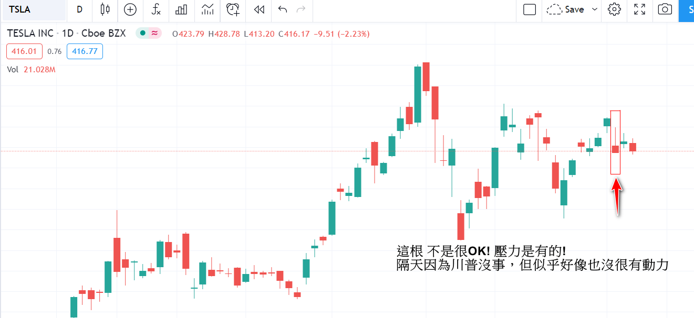
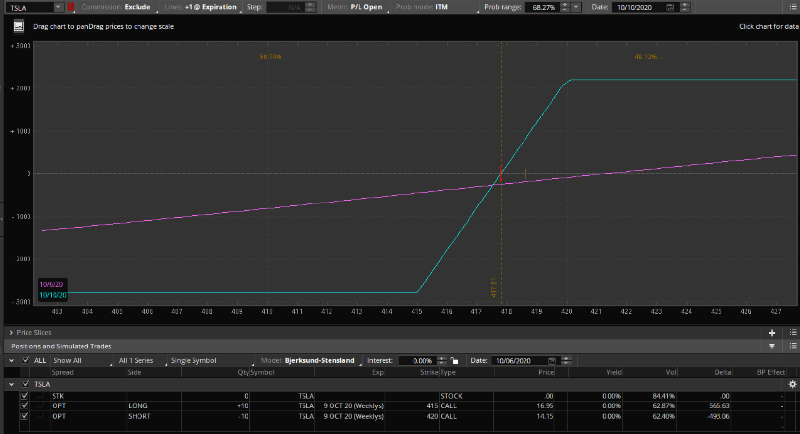
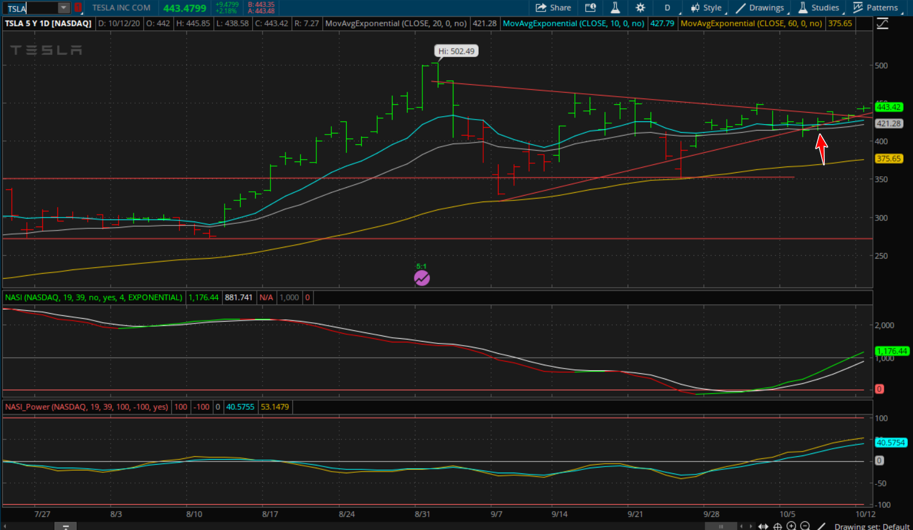

#### TSLA

成績

| 20200928 | 20201006 | 20201007 | 4    | 5    | 6    | 7    | 8    | 9    | 10   |
| -------- | -------- | -------- | ---- | ---- | ---- | ---- | ---- | ---- | ---- |
| 80%      | -15%     | 80%      |      |      |      |      |      |      |      |

-----

### 20200928 

一周交易時間

星期一進場

 心得:

​    10/2 川普中了武漢病毒，引發市場驚恐，狂跌!

​    當時進場的損益平衡點是 412附近，且交易時間是一周。剛好結算的價格是415 ，高於停損點。此交易是80%獲利。

​    **是成功的交易**

​    **改善:  前二天進場 會是好時機 **

### 2020/10/06

這次交易失敗! 損失10%

2020/10/05 進場，但今天沒甚麼動能，且跌到停損點!

### 2020/10/07

川普突然說 趕快讓紓困案通過，多少的金額都會同意。因此，這天以425的價格進場! 

目前未止，漲勢有起來!

若這星期未跌破425, 獲利80% ==> 已經獲利80%!!

