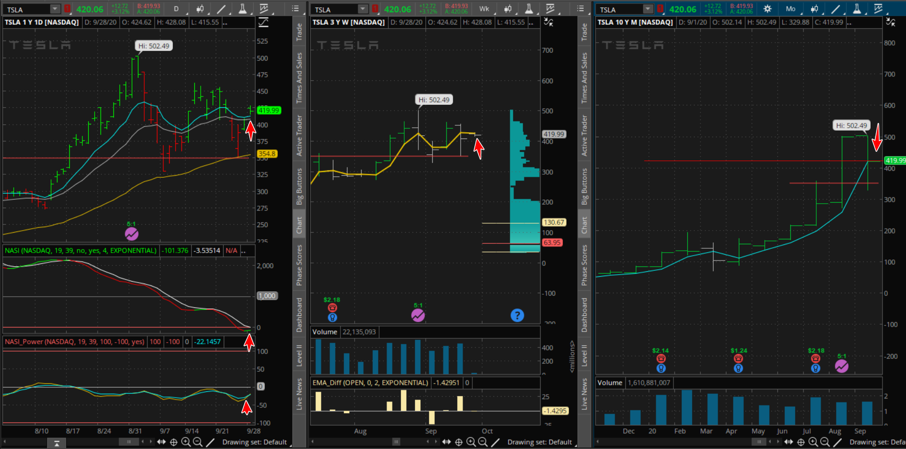

#### TSLA

### 20200928 

一周交易時間

星期一進場

 心得:

​    10/2 川普中了武漢病毒，引發市場驚恐，狂跌!

​    當時進場的損益平衡點是 412附近，且交易時間是一周。剛好結算的價格是415 ，高於停損點。此交易是80%獲利。

​    **是成功的交易**

​    **改善:  前二天進場 會是好時機 **

接下來的觀察:

   

