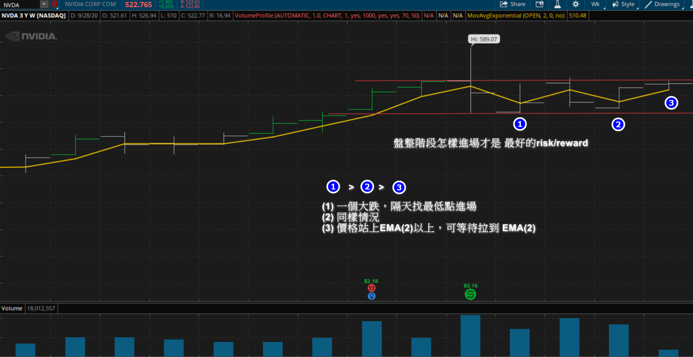
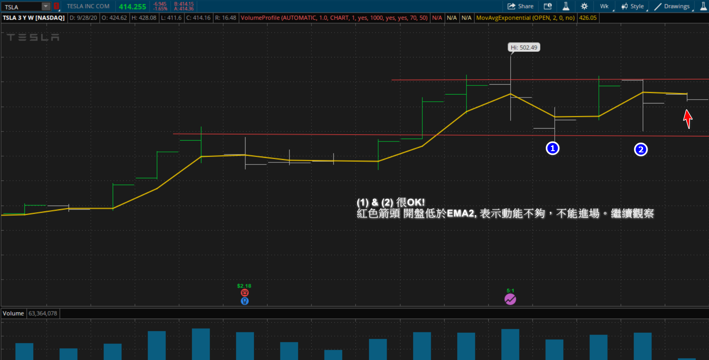
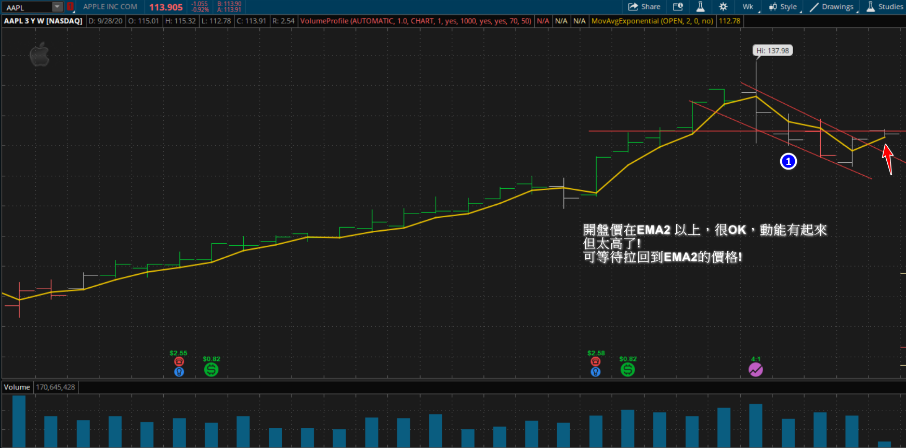
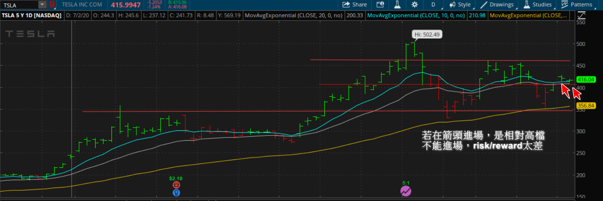

### Basic Rules

1. **交易15次** (複利進場)

  * 每次至少80%獲利

  * 最多20%虧損

2. **選股**
 * 盡量先找QoQ很強的!
 * 用QoQ&獲利來排序

3. **趨勢**
 * 大盤盤整時，個股也會呈現盤整。
 * 在盤整時，部位最多損失50%。也就是說，站整個資金的40%。即使，盤整還是有機會賺到錢!

#### Setup 1 : [串穿抄底 (交易時間一周 / 部位是40%的資金 / 最多50%的損失)](setup1.html)

​                     **不能進場的時機** ==> 價格離月均線太遠!!

​                     **貫穿這跟若是紅色，下周再跌機率大**

​                

相對位置的Risk/Reward

