## 不確定因素:

* 中美貿易
* 南海戰爭
* 香港政治議題
* 疫情影響
* 總統選舉
* 疫苗: 11月初有疫苗，可達到 50% ~ 60% 有效，先控制疫情

目前結論:

    1. 經濟有起色(基本面好轉)
    2. 總統大選，川普會讓股市維持漲的格局
    3. 因為大撒錢，經濟數據都是參考參考~等大選過後，才可看到真實現象?
    4. 刺激方案!!
    5. 疫苗?!年底有望?! 沒機會，就不會有大漲!

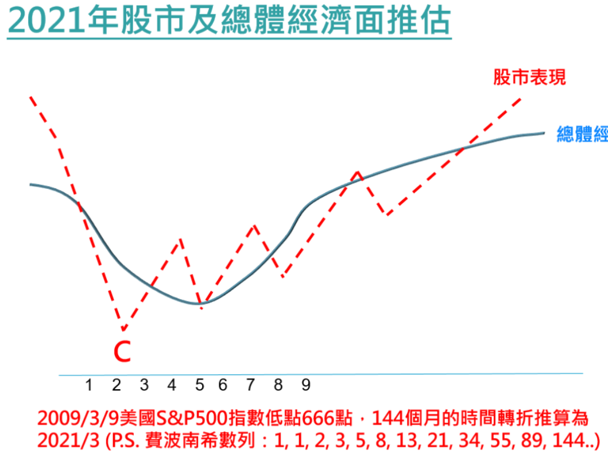

## 20200930
   迪士尼 lay-off 2.8萬人！ 影響失業率？

## 20200927

https://www.advisorperspectives.com/dshort/updates/2020/09/25/headline-durable-goods-orders-up-0-4-in-august

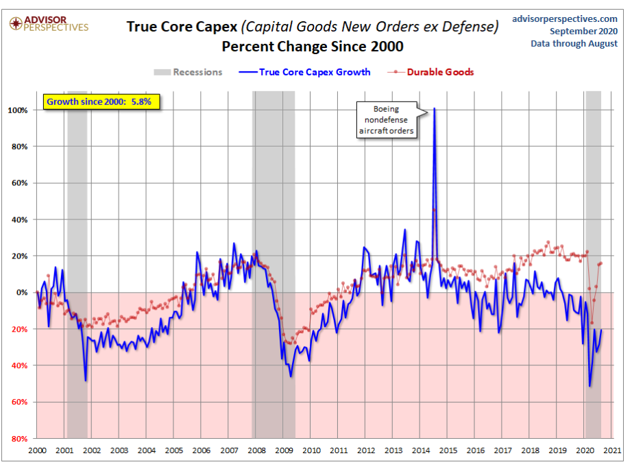

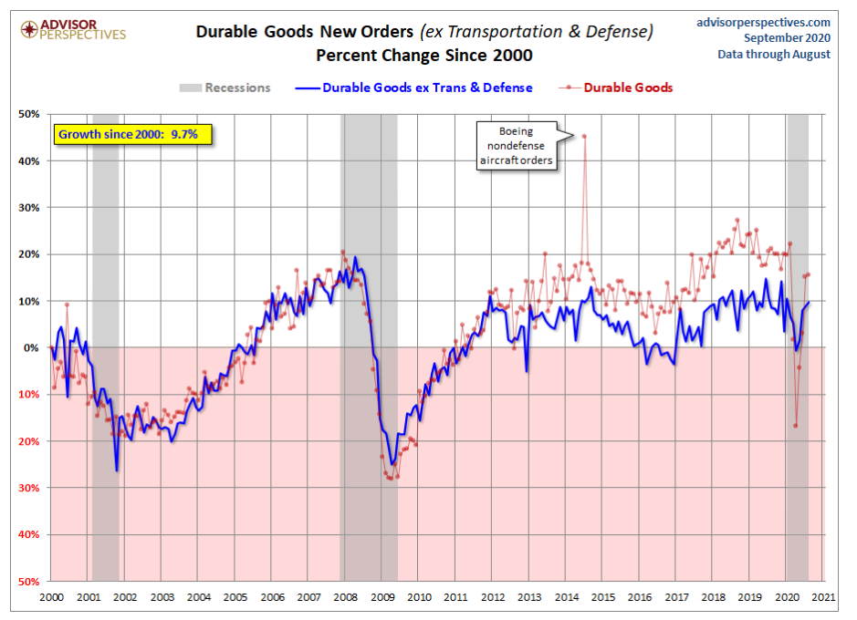

 ## 20200906

9/3, 9/4大跌後，在50天有支撐，且出現強烈買盤。目前認為還是多頭格局不變

**九月份也許不適合交易!!!! 等到九月底看看，有沒有打底的跡**象

**預期有個W底出現!**

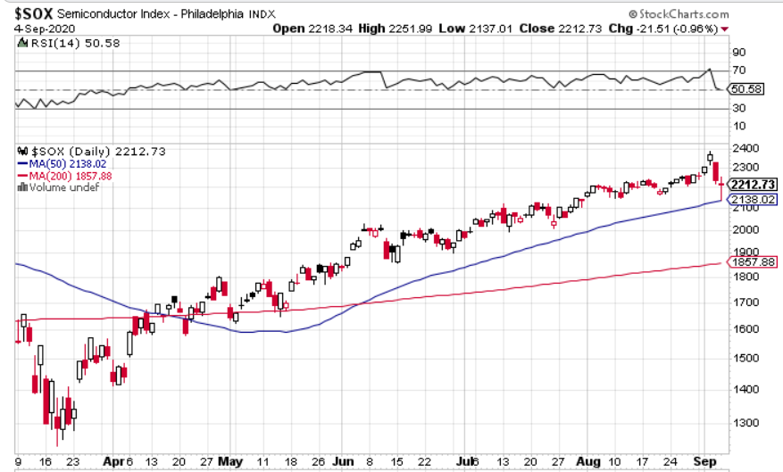

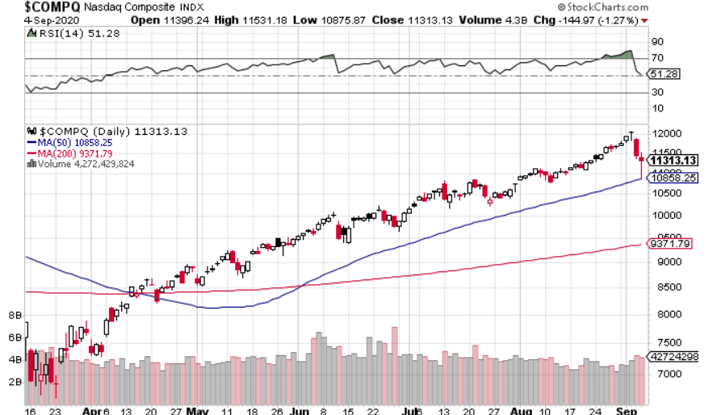

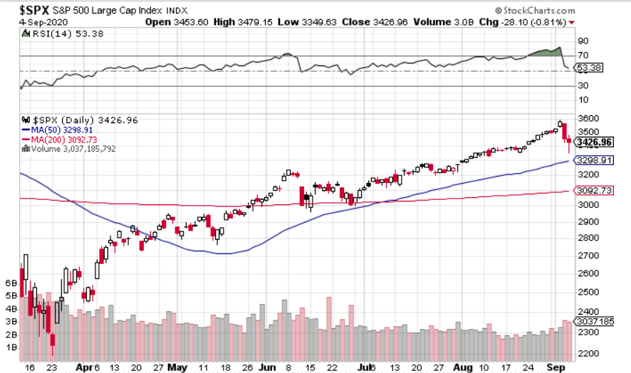

* 就業率有好轉!

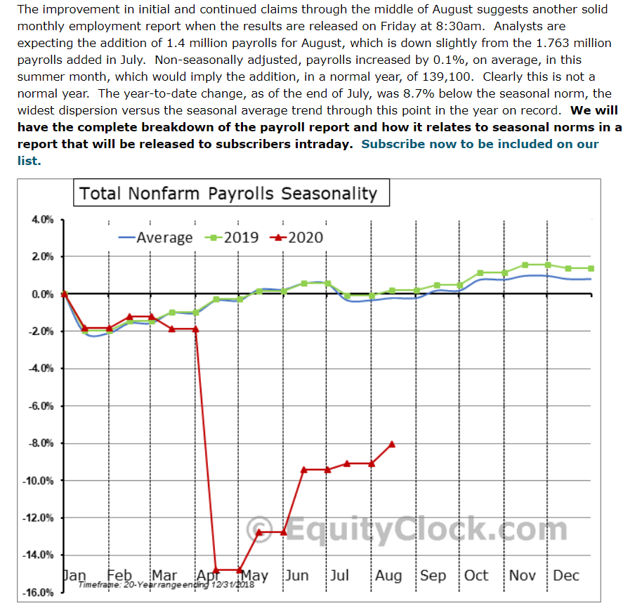

## 20200824

1. https://www.bbc.com/news/world-us-canada-53884710 川普同意使用 corona virus  plasma treatment，股市盤前長。proven to reduce mortality by 35%

八月20號，公布失業率增加。但目前川普有個人的紓困

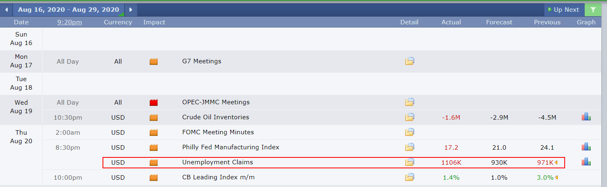

## 20200815

http://tmba.tw/wordpress/wp-content/uploads/2020/08/20200810_Global-Financial-Outlook.pdf

* 已經是最壞的了嗎? (GDP)??? 就業? 需求端? 消費市場?

  **[Comment]**

  ​    (1) PMI/NMI 數據達到50以上，開始擴張。表示經濟有開始改善。

  ​    (2) 新訂單/未完成訂單都是50以上(Not bad)

  ​    (3) 零售銷售轉正: 主要是川普大撒錢，看來民眾是有拿錢消費

  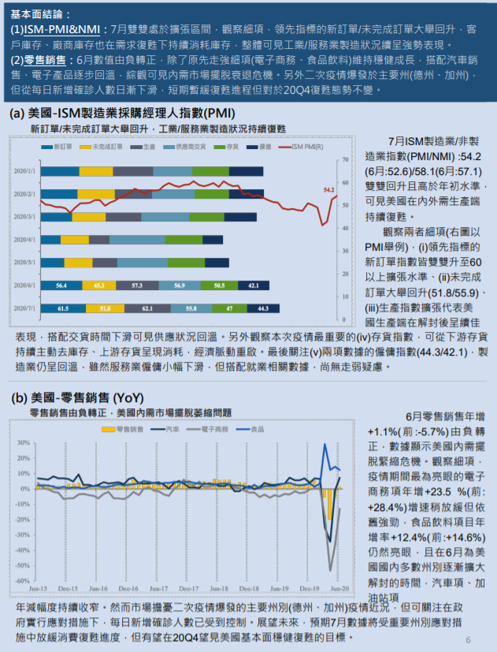

 就業人口，有持續改善!

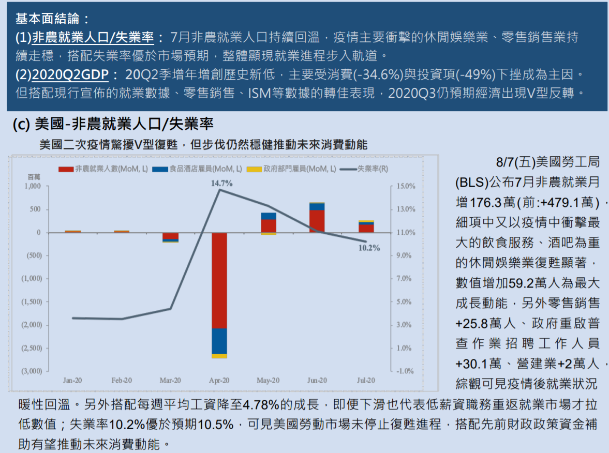

* FED的政策面

  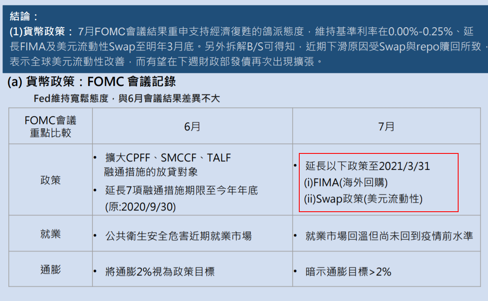

## 20200803 

* 聯準會 - 持續寬鬆與利率不變 以及 且延長延長融通措施

* 紓困案(Q2 GDP -32%) 

* 已經是最壞的了嗎? (GDP)

